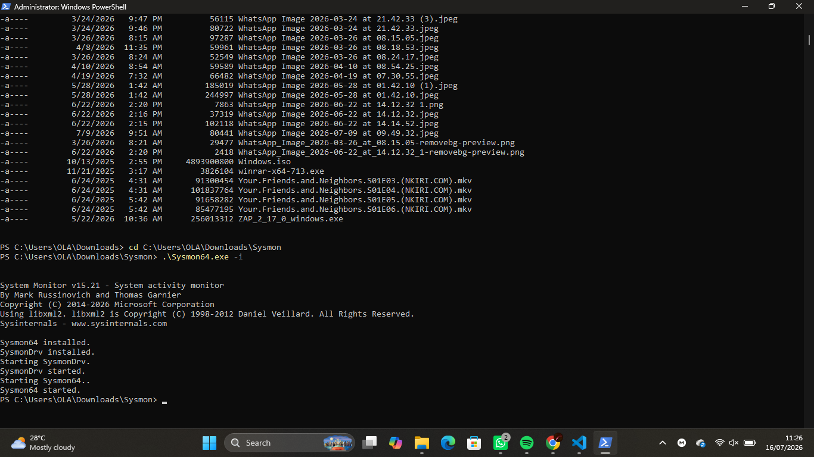
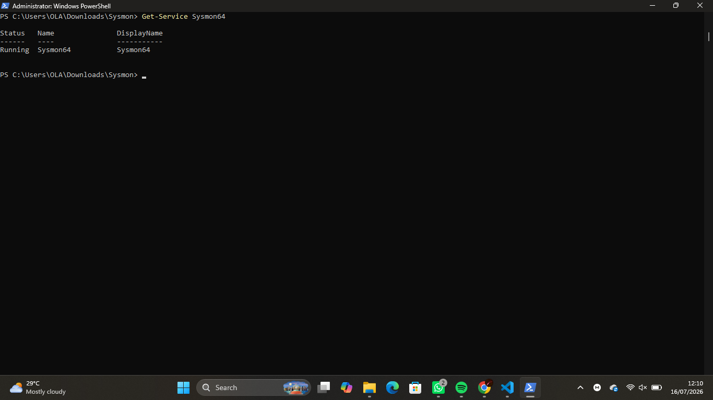
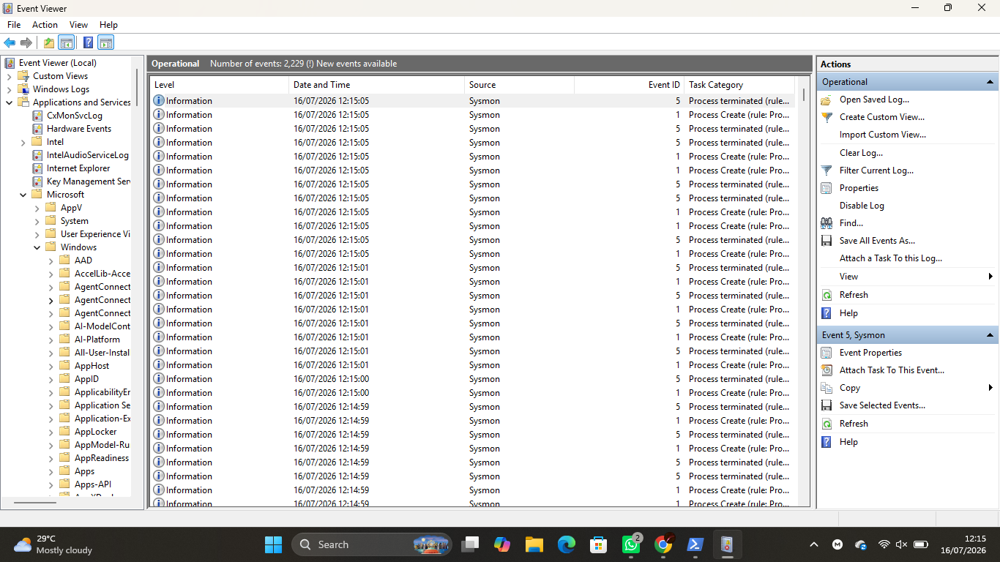
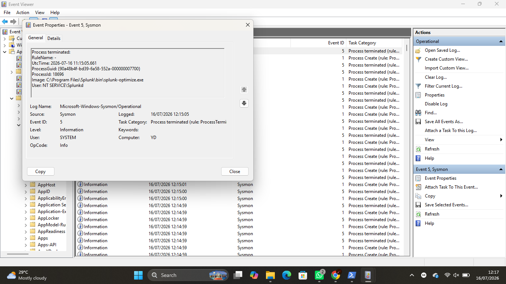
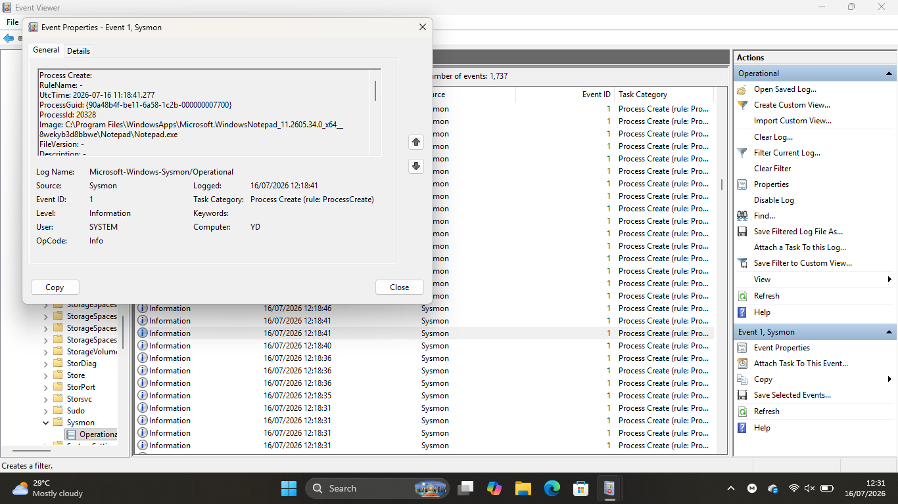

# Lab 01 — Sysmon Fundamentals

## Objective

Installed and configured Microsoft Sysmon on a Windows endpoint to improve system visibility and generate detailed security logs for threat hunting, detection engineering, and incident response.

---

## Scenario

As a Junior SOC Analyst, I was tasked with deploying Sysmon on a Windows workstation to enhance endpoint monitoring. After installation, I verified that Sysmon was collecting events and analyzed the generated logs to understand the information available during a security investigation.

---

## Environment

- Windows 11
- PowerShell
- Event Viewer
- Microsoft Sysinternals Sysmon

---

## Skills Practiced

- Sysmon installation
- Endpoint monitoring
- Windows Event Viewer
- Process analysis
- Security logging
- Event ID analysis
- Security documentation

---

## Background Theory

Sysmon (System Monitor) is a Microsoft Sysinternals tool that extends the default Windows logging capabilities by recording detailed information about system activity.

It provides valuable endpoint telemetry such as:

- Process creation
- Network connections
- File creation
- Registry modifications
- DNS queries

SOC Analysts use Sysmon to improve visibility, investigate suspicious activity, perform threat hunting, and support incident response.

---

## Installation

Open **PowerShell as Administrator** and navigate to the extracted Sysmon folder.

```powershell
.\Sysmon64.exe -i
```

---

## Verify Installation

```powershell
Get-Service Sysmon64
```

---

## Event Viewer Location

```
Applications and Services Logs
└── Microsoft
    └── Windows
        └── Sysmon
            └── Operational
```

---

## Common Sysmon Event IDs

| Event ID | Description |
|----------|-------------|
| 1 | Process Creation |
| 3 | Network Connection |
| 5 | Process Terminated |
| 7 | Image Loaded |
| 11 | File Created |
| 13 | Registry Value Set |
| 22 | DNS Query |

---

## Lab Tasks

### Part 1 — Download Sysmon

- Download Sysmon from Microsoft Sysinternals.
- Extract the downloaded ZIP file.

---

### Part 2 — Install Sysmon

Run:

```powershell
.\Sysmon64.exe -i
```

📸 Screenshot

```
screenshots/sysmon-install.png
```

---

### Part 3 — Verify Installation

Run:

```powershell
Get-Service Sysmon64
```

📸 Screenshot

```
screenshots/sysmon-service.png
```

---

### Part 4 — Open Event Viewer

Navigate to the Sysmon Operational log.

📸 Screenshot

```
screenshots/event-viewer.png
```

---

### Part 5 — Examine an Event

Open a Process Creation event and observe:

- Event ID
- Image
- User
- Parent Process
- Command Line
- Timestamp

📸 Screenshot

```
screenshots/event-details.png
```

---

### Part 6 — Generate Activity

Open:

- Notepad
- Calculator
- Command Prompt

Refresh the Sysmon Operational log and locate the generated events.

📸 Screenshot

```
screenshots/process-events.png
```

---

## Commands Used

```powershell
.\Sysmon64.exe -i

Get-Service Sysmon64
```

---

## Screenshots

### Sysmon Installation



---

### Sysmon Service



---

### Event Viewer



---

### Event Details



---

### Process Creation Events



---

## What I Observed

- Sysmon installed successfully and started as a Windows service.
- The Sysmon Operational log was available in Event Viewer.
- Process Creation events (Event ID 1) were generated after launching applications.
- Each event included detailed information such as the process name, parent process, command line, user account, and timestamp.
- Sysmon provided significantly more endpoint visibility than the default Windows Event Logs.

---

## Challenges Faced

- Running Sysmon required PowerShell with Administrator privileges.
- Understanding the different event fields required careful inspection of each log entry.
- Some Event IDs (such as DNS Query events) may not appear with the default configuration.

---

## SOC Relevance

Sysmon is one of the most widely used endpoint monitoring tools in Security Operations Centers. Its detailed logs enable analysts to investigate suspicious processes, monitor endpoint activity, perform threat hunting, develop detection rules, and support incident response.

---

## Outcome

Successfully installed Microsoft Sysmon, verified its operation, explored Sysmon Operational logs, generated endpoint activity, and analyzed Process Creation events to gain foundational experience with endpoint telemetry used in SOC investigations.
- Security Documentation
