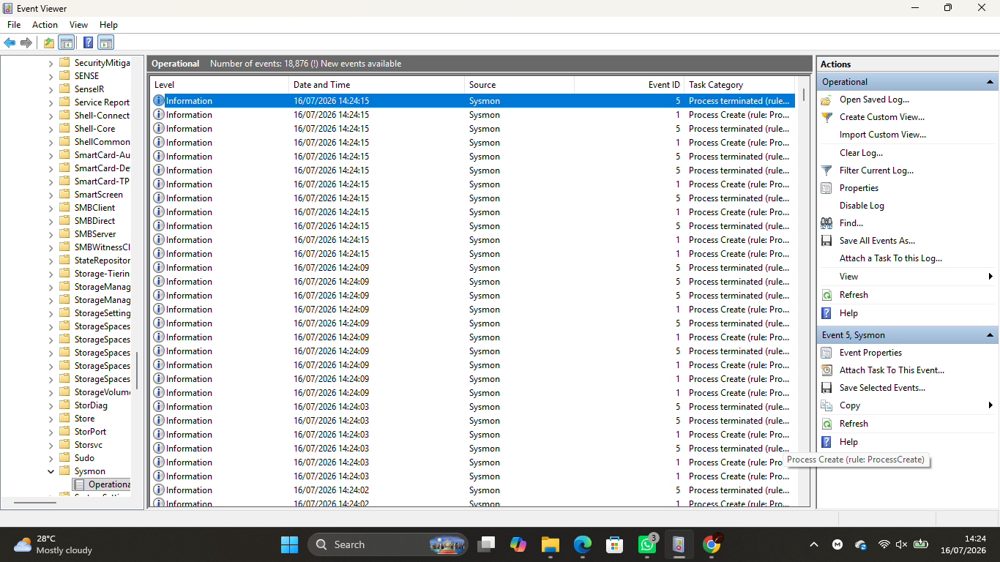
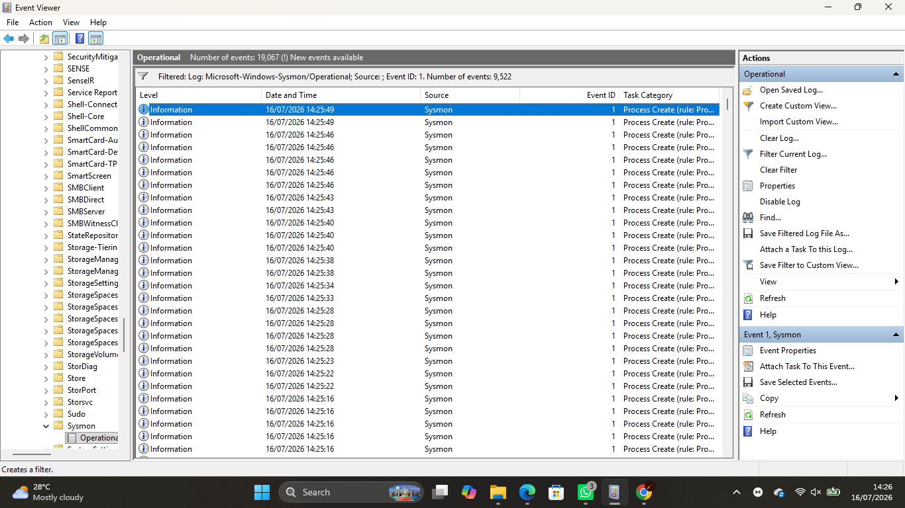
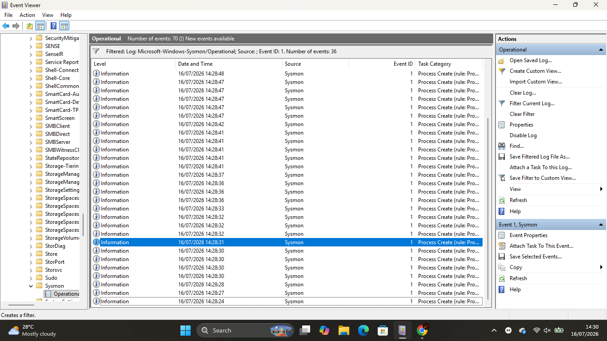
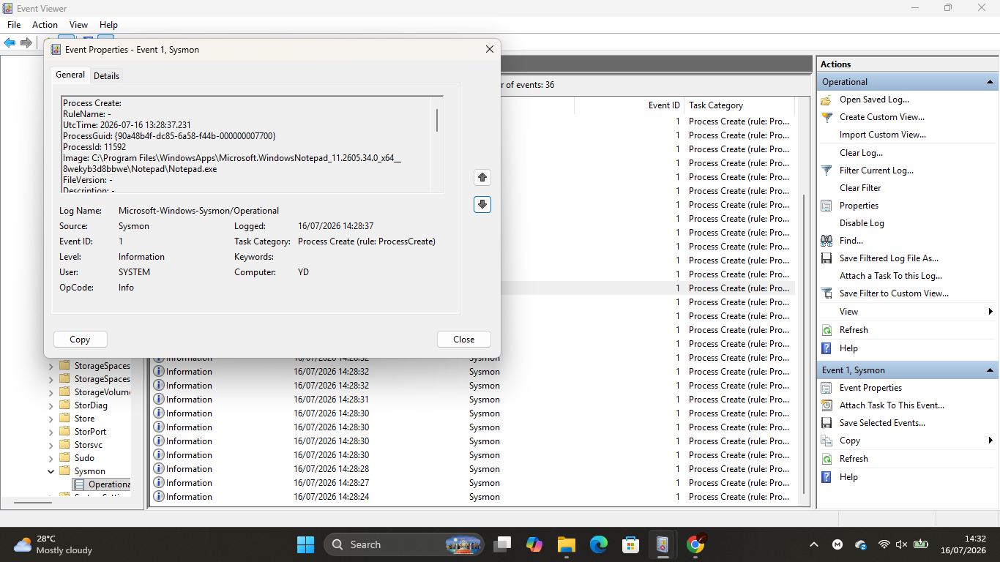

# Lab 02 — Sysmon Log Analysis

## Objective

Analyzed Sysmon Process Creation events to understand how endpoint activity is recorded, identify parent-child process relationships, and investigate normal Windows processes from a SOC analyst's perspective.

---

## Scenario

A user reported unusual behavior on their Windows workstation. As a Junior SOC Analyst, your task is to review Sysmon logs, identify recently executed processes, and determine whether the observed activity is legitimate or suspicious.

---

## Environment

- Windows 11
- Microsoft Sysmon
- Event Viewer
- PowerShell

---

## Skills Practiced

- Sysmon log analysis
- Event ID analysis
- Process investigation
- Parent-child process relationships
- Command-line analysis
- Security event documentation
- Endpoint monitoring

---

## Background Theory

Sysmon records detailed endpoint activity that helps security analysts investigate suspicious behavior. One of its most valuable logs is **Event ID 1 (Process Creation)**, which records every process started on the system along with important details such as:

- Process Name
- Parent Process
- User Account
- Command Line
- Process ID
- Timestamp

By analyzing these fields, SOC analysts can reconstruct user activity, detect suspicious executions, and identify malicious behavior.

---

## Lab Tasks

### Part 1 — Open the Sysmon Operational Log

Open **Event Viewer** and navigate to:

```text
Applications and Services Logs
└── Microsoft
    └── Windows
        └── Sysmon
            └── Operational
```

📸 Screenshot

```text
screenshots/sysmon-operational-log.png
```

---

### Part 2 — Filter Process Creation Events

Select **Filter Current Log...**

Filter using:

```text
Event ID: 1
```

This displays only Process Creation events.

📸 Screenshot

```text
screenshots/eventid1-filter.png
```

---

### Part 3 — Generate Endpoint Activity

Launch the following applications:

- Notepad
- Calculator
- Paint
- Command Prompt

Close each application after opening it.

Refresh the Sysmon Operational log.

📸 Screenshot

```text
screenshots/generated-processes.png
```

---

### Part 4 — Analyze a Process Creation Event

Open one Process Creation event and record the following information:

- Event ID
- Process Name (Image)
- Parent Process (Parent Image)
- Command Line
- User Account
- Process ID
- Timestamp

📸 Screenshot

```text
screenshots/notepad-analysis.png
```

---

### Part 5 — Compare Process Activity

Compare at least two Process Creation events.

Consider the following questions:

- Which process started first?
- Did they have the same parent process?
- Were the command lines different?
- Which process would deserve more attention during an investigation?

Record your findings in **investigation-report.md**.

---

### Part 6 — Investigate Parent Processes

Research the Parent Image field.

Common examples include:

- explorer.exe
- cmd.exe
- powershell.exe

Explain why identifying the parent process is important during an investigation.

---

### Part 7 — Export Evidence

Export the filtered Process Creation events as:

```text
artifacts/sysmon-eventid1.evtx
```

---

## Commands Used

No PowerShell commands were required for this lab.

Primary tool used:

- Event Viewer

---

## Screenshots

### Sysmon Operational Log



---

### Event ID 1 Filter



---

### Generated Process Events



---

### Process Analysis



---

## What I Observed

- Event ID 1 logs were generated whenever an application was launched.
- Each event contained detailed information about the executed process.
- Parent-child process relationships were visible within the event details.
- Command-line arguments provided additional context about process execution.
- The observed activity matched the applications intentionally opened during the lab.

---

## Challenges Faced

- Identifying the correct Process Creation events among many system-generated events.
- Understanding the relationship between parent and child processes.
- Interpreting the different fields contained within a Sysmon event.

---

## SOC Relevance

Process Creation events are among the most valuable sources of endpoint telemetry for SOC analysts. They help detect suspicious executions, investigate malware, trace attacker activity, and understand how applications are launched within a Windows environment.

---

## Outcome

Successfully analyzed Sysmon Process Creation events, investigated parent-child process relationships, examined command-line information, and developed practical experience interpreting endpoint telemetry for security investigations.
