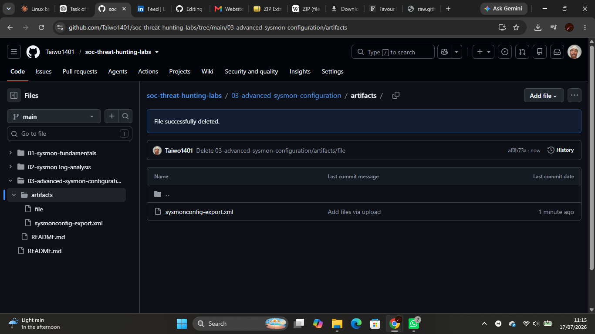
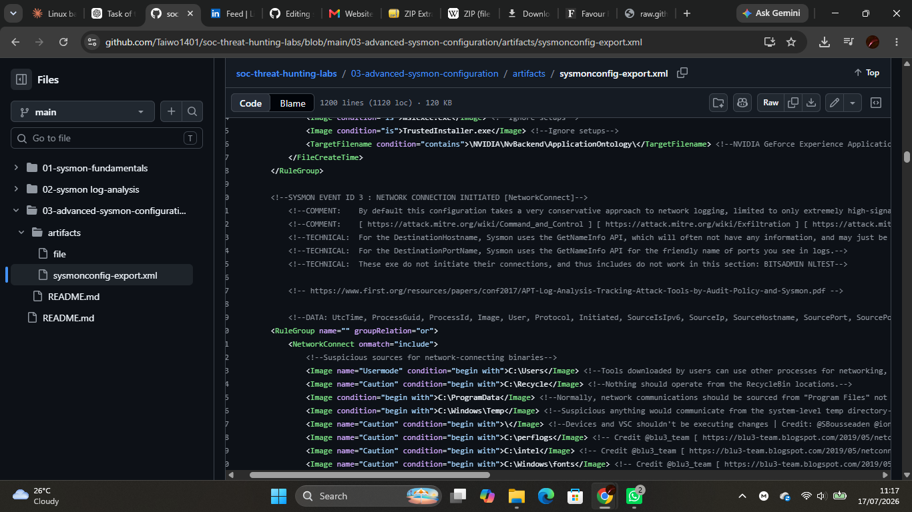
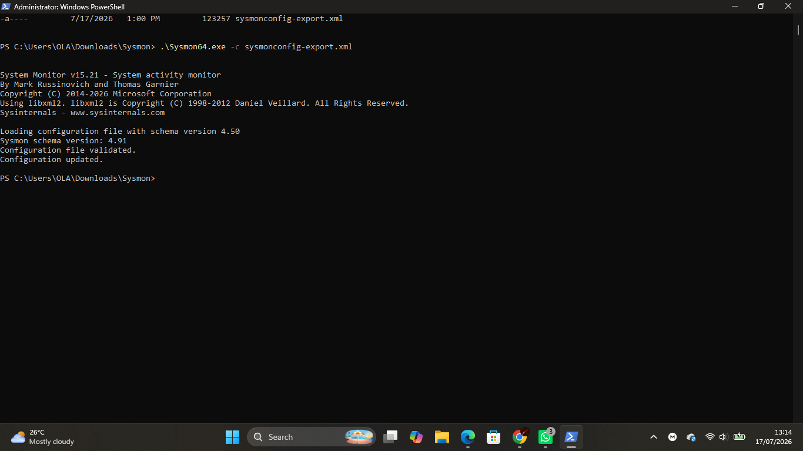
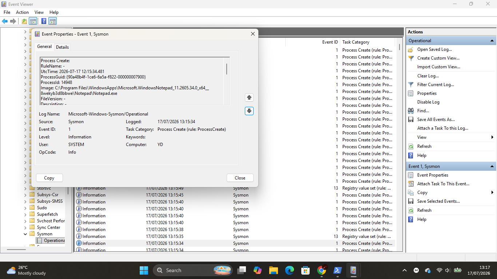

# Lab 03 — Advanced Sysmon Configuration

## Objective

Configured Microsoft Sysmon using the SwiftOnSecurity community configuration to improve endpoint visibility and collect more detailed security events for threat detection and incident response.

---

## Scenario

An organization requires more detailed endpoint logging than the default Sysmon configuration provides. As a Junior SOC Analyst, your task is to deploy a custom Sysmon configuration, verify it is applied successfully, and observe the additional telemetry generated.

---

## Environment

- Windows 11
- Microsoft Sysmon
- SwiftOnSecurity Sysmon Configuration
- PowerShell
- Event Viewer
- Visual Studio Code (or Notepad)

---

## Skills Practiced

- Sysmon configuration
- XML configuration analysis
- Endpoint monitoring
- Event Viewer analysis
- Windows logging
- Threat detection fundamentals
- Security documentation

---

## Background Theory

The default Sysmon configuration captures only a limited set of events. Security teams commonly deploy customized configuration files to improve endpoint visibility by recording additional security-relevant activity.

The SwiftOnSecurity Sysmon configuration is one of the most widely used community-maintained configurations and is designed to balance useful security logging with manageable log volume.

---

## Configuration Areas Reviewed

| Configuration | Purpose |
|--------------|---------|
| ProcessCreate | Logs newly created processes |
| NetworkConnect | Logs outbound network connections |
| FileCreate | Logs newly created files |
| RegistryEvent | Logs Windows Registry modifications |
| DnsQuery | Logs DNS lookup requests |

---

## Lab Tasks

### Part 1 — Research Sysmon Configurations

Research the following:

- What is a Sysmon configuration file?
- Why do organizations customize Sysmon?
- What are the limitations of the default configuration?

---

### Part 2 — Download the Configuration

Downloaded the SwiftOnSecurity Sysmon configuration from GitHub.

📸 Screenshot

```text
screenshots/sysmon-config-download.png
```

---

### Part 3 — Examine the Configuration

Opened the XML configuration file and reviewed important logging sections including:

- ProcessCreate
- NetworkConnect
- FileCreate
- RegistryEvent
- DnsQuery

📸 Screenshot

```text
screenshots/sysmon-config-overview.png
```

---

### Part 4 — Apply the Configuration

Executed:

```powershell
.\Sysmon64.exe -c sysmonconfig-export.xml
```

Verified that Sysmon successfully updated its configuration.

📸 Screenshot

```text
screenshots/sysmon-config-installed.png
```

---

### Part 5 — Generate Endpoint Activity

Performed the following actions:

- Opened Notepad
- Opened Command Prompt
- Created a text file
- Visited a website
- Refreshed the Sysmon Operational log

📸 Screenshot

```text
screenshots/new-events.png
```

---

### Part 6 — Compare Results

Compared the default Sysmon configuration with the custom configuration.

Observed differences in:

- Logged event types
- Event details
- Endpoint visibility

---

## Commands Used

```powershell
.\Sysmon64.exe -c sysmonconfig-export.xml
```

---

## Artifacts

```text
artifacts/
└── sysmonconfig-export.xml
```

---

## Screenshots

### Configuration Download



---

### Configuration Overview



---

### Configuration Applied



---

### New Sysmon Events



---

## What I Observed

- The custom configuration was successfully applied.
- The XML configuration defined multiple event categories for monitoring.
- Sysmon continued logging endpoint activity after the configuration update.
- Additional event types and richer telemetry became available compared to the default configuration.
- Endpoint visibility was significantly improved.

---

## Challenges Faced

- Understanding the structure of the XML configuration file.
- Identifying the purpose of different configuration sections.
- Comparing the default and customized Sysmon configurations.

---

## SOC Relevance

Custom Sysmon configurations provide SOC analysts with richer endpoint telemetry, improving the detection of suspicious process execution, malicious network activity, registry persistence, and file creation. Proper configuration is essential for effective threat hunting and incident response.

---

## Outcome

Successfully deployed a community-maintained Sysmon configuration, validated the update, explored the configuration structure, and observed how custom configurations improve endpoint visibility and security monitoring.
