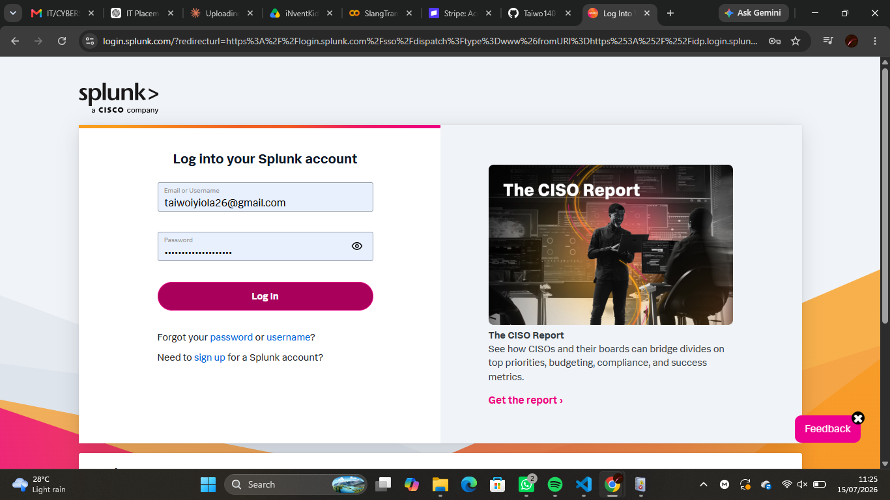
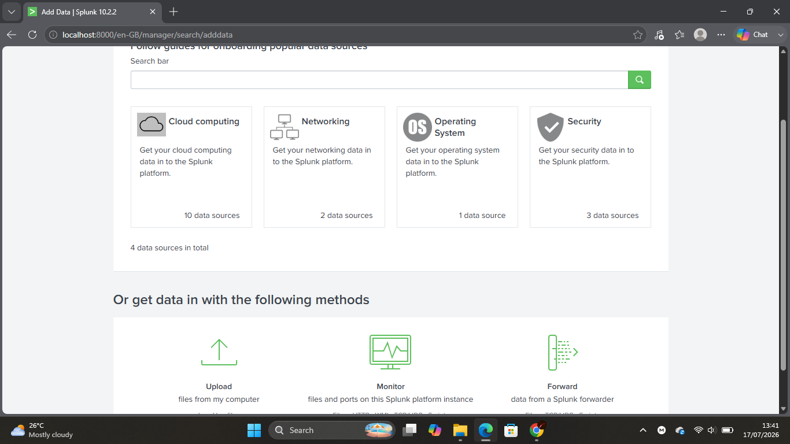
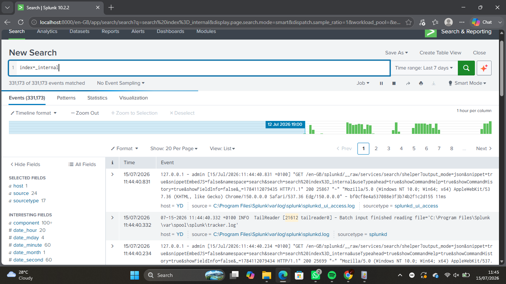
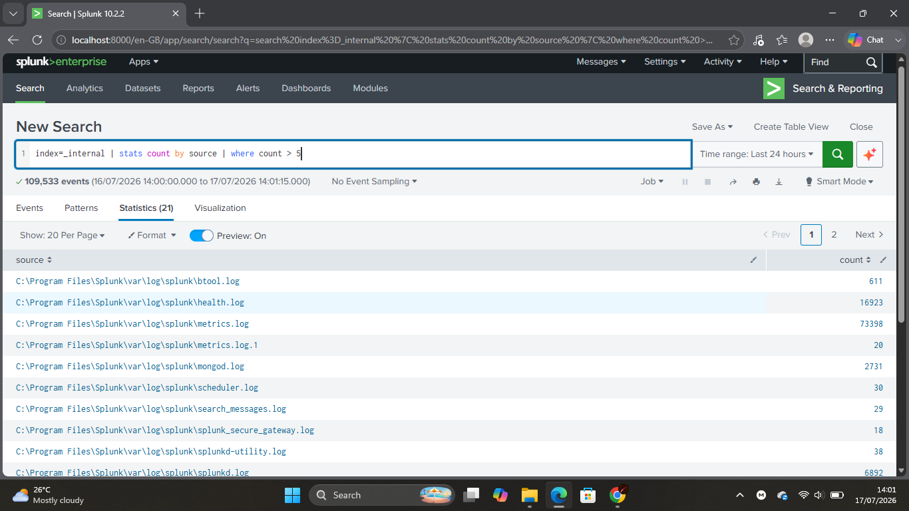

# Lab 04 — Splunk Installation & Initial Data Verification

## Objective

Installed Splunk Enterprise, explored the Search & Reporting application, and verified the availability of indexed data. Confirmed that Splunk internal logs were searchable while identifying that Windows Sysmon logs had not yet been ingested.

---

## Scenario

An organization has deployed Splunk Enterprise to centralize security logs. As a Junior SOC Analyst, the task is to verify that Splunk is operational, identify available data sources, and determine whether endpoint telemetry from Sysmon is available for investigation.

---

## Environment

- Windows 11
- Splunk Enterprise
- Web Browser
- Sysmon
- PowerShell

---

## Skills Practiced

- Splunk installation verification
- Search & Reporting
- Basic SPL queries
- Index verification
- Data source validation
- SIEM fundamentals

---

## Background Theory

A Security Information and Event Management (SIEM) platform collects, indexes, and analyzes logs from multiple systems. Before analysts can investigate security events, the relevant log sources must first be ingested into the SIEM.

Splunk stores data inside indexes. Analysts search these indexes using the Splunk Processing Language (SPL).

---

## Lab Tasks

### Part 1 — Verify Splunk Installation

Confirmed that Splunk Enterprise was running successfully.

📸 Screenshot

```text
screenshots/splunk-login.png
```

---

### Part 2 — Access Splunk

Logged into the Splunk Enterprise web interface.

📸 Screenshot

```text
screenshots/splunk-home.png
```

---

### Part 3 — Explore Data Inputs

Reviewed the available methods for adding data into Splunk.

📸 Screenshot

```text
screenshots/add-data.png
```

---

### Part 4 — Verify Available Data

Executed searches to determine which logs were currently indexed.

Searches performed:

```spl
index=*
```

```spl
index=_internal
```

```spl
Sysmon
```

Observed that only Splunk internal logs were available.

📸 Screenshot

```text
screenshots/internal-events.png
```

---

### Part 5 — Execute Initial Searches

Performed basic SPL searches to verify search functionality.

Verified that:

- Internal logs were searchable.
- Sysmon events were not yet available.
- Additional configuration is required to ingest Windows Event Logs.

📸 Screenshot

```text
screenshots/first-search.png
```

---

## Commands Used

```spl
index=*
```

```spl
index=_internal
```

```spl
Sysmon
```

---

## Screenshots

### Splunk Login



---

### Splunk Home


---

### Add Data



---

### Internal Events



---

### First Search



---

## What I Observed

- Splunk Enterprise was successfully installed.
- The Search & Reporting application functioned correctly.
- Internal Splunk logs were indexed and searchable.
- Searches for `index=*` returned no Windows event data.
- Searches for Sysmon events returned no results.
- Windows Event Logs had not yet been configured for ingestion.

---

## Challenges Faced

- Initially expected Sysmon events to appear automatically.
- Learned that installing Sysmon does not automatically send logs to Splunk.
- Identified that additional data ingestion configuration is required.

---

## SOC Relevance

A SIEM is only as effective as the data it receives. Verifying data ingestion is one of the first responsibilities of a SOC analyst before beginning threat hunting or incident investigations.

---

## Outcome

Successfully verified that Splunk was operational, confirmed the availability of internal logs, and identified the need to configure Windows and Sysmon log ingestion before conducting security investigations.
