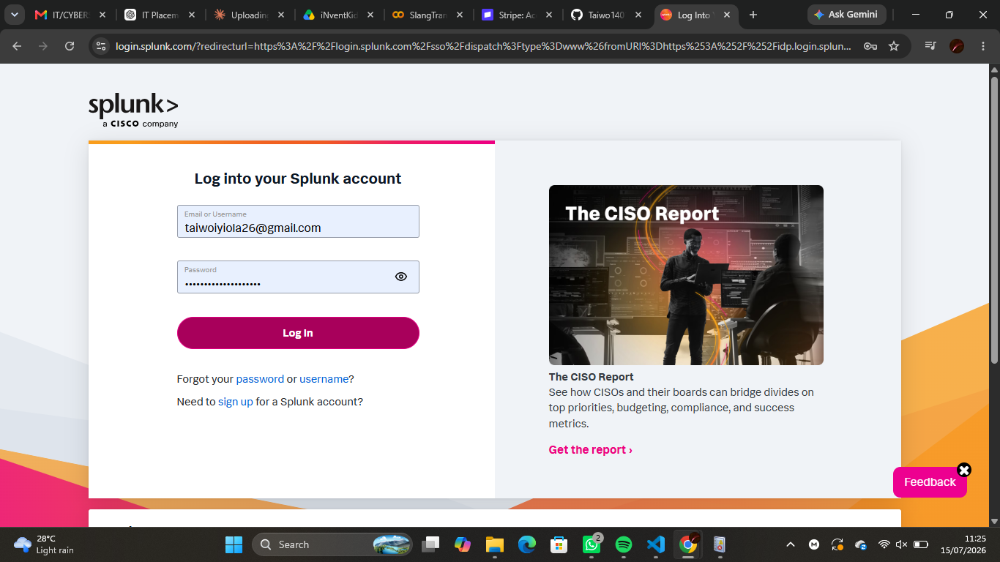
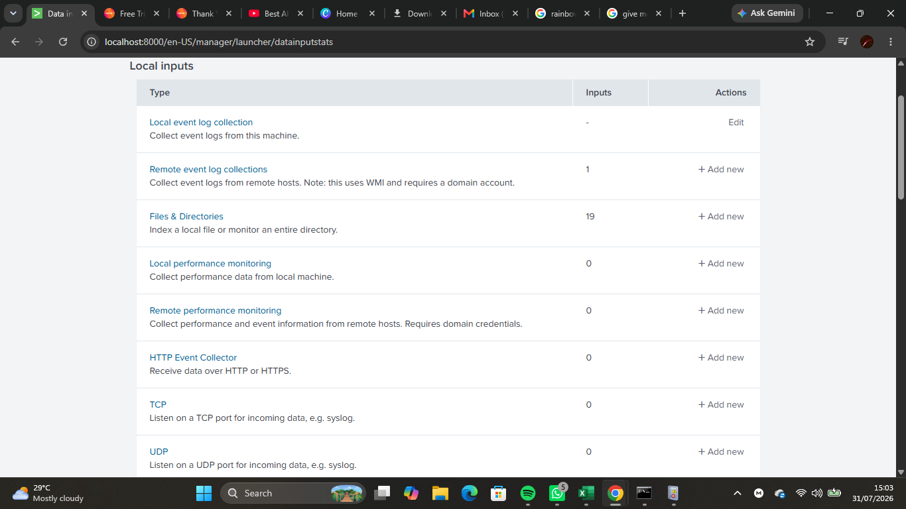
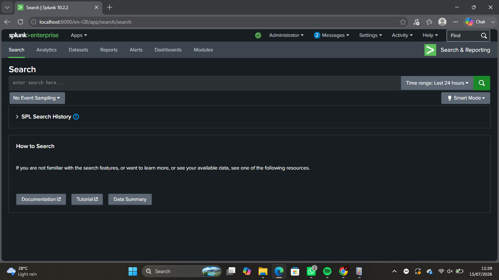
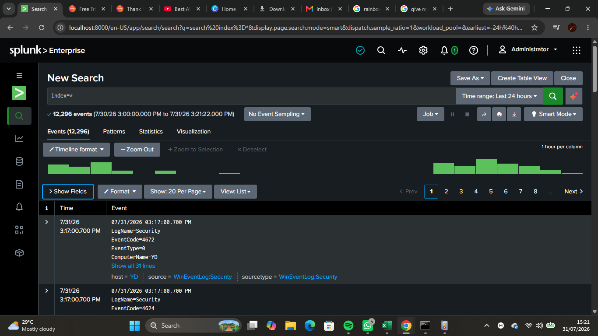
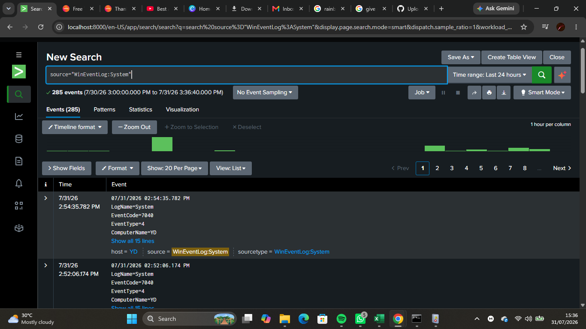
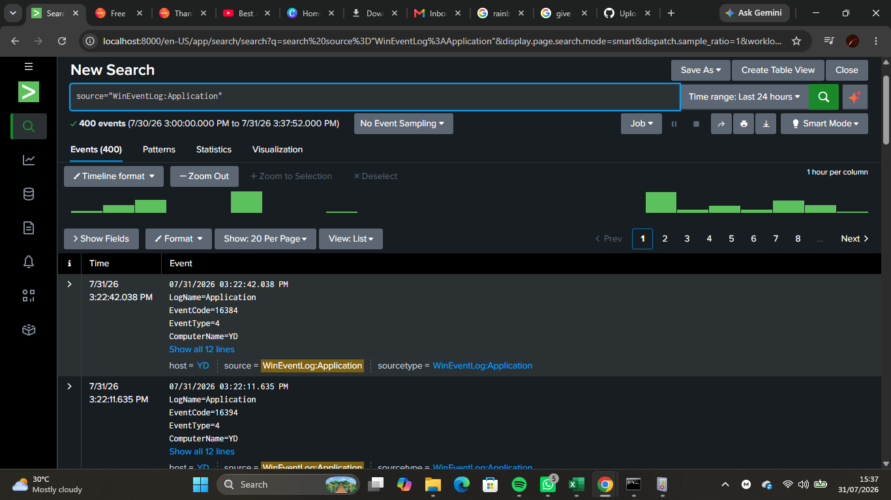

# Lab 05 — Windows Event Log Collection with Splunk

## Objective

Configured Splunk Enterprise to collect Windows Event Logs from the local Windows machine and verified that the logs could be searched using Splunk Search Processing Language (SPL).

---

## Background Theory

A Security Information and Event Management (SIEM) platform centralizes log collection, analysis, and monitoring from multiple systems.

Windows Event Logs provide valuable information about system activity, user authentication, application behavior, and security events. By collecting these logs into Splunk, SOC analysts can monitor endpoints, investigate incidents, and detect suspicious activity using SPL queries.

---

## Lab Environment

- Host Operating System: Windows 11
- SIEM Platform: Splunk Enterprise
- Data Source: Windows Event Logs
- Endpoint Monitoring: Microsoft Sysmon
- Search Language: SPL (Search Processing Language)

---

## Skills Practiced

- Installing Splunk Enterprise
- Configuring Local Event Log Collection
- Understanding Windows Event Logs
- Windows log ingestion
- Writing basic SPL queries
- Verifying indexed events
- Basic SIEM administration

---

## Windows Event Logs Collected

- Application
- Security
- System

> **Note:** Microsoft-Windows-Sysmon/Operational was available in Windows Event Viewer but was not listed in the Local Event Log Collection page during this lab.

---

## SPL Queries Used

### Display all indexed events

```spl
index=*
```

### Display events from the main index

```spl
index=main
```

### Search Security Events

```spl
source="WinEventLog:Security"
```

### Search System Events

```spl
source="WinEventLog:System"
```

### Search Application Events

```spl
source="WinEventLog:Application"
```

---

## Screenshots

### Splunk Login



---

### Local Event Log Configuration



---

### Search & Reporting



---

### All Indexed Events



---

### Security Events


---

### System Events



---

### Application Events



---

### Event Details


---

## What I Observed

- Splunk Enterprise successfully launched and accepted local log collection.
- Windows Event Logs were configured for ingestion.
- SPL queries were used to search indexed events.
- Security, System, and Application logs can be monitored from a centralized SIEM platform.
- Event details provide timestamps, host information, source, sourcetype, and other useful metadata for investigations.

---

## Challenges Faced

- The initial Splunk installation produced an internal **"Oops"** error when configuring Local Event Log Collection.
- Reinstalling Splunk Enterprise resolved the configuration issue.
- Microsoft-Windows-Sysmon/Operational existed in Windows Event Viewer but was not available as a selectable local event log within Splunk during this lab.
- Troubleshooting installation and configuration issues reinforced the importance of validating SIEM deployments before collecting evidence.

---

## SOC Relevance

Windows Event Logs are one of the primary data sources used in a Security Operations Center (SOC).

SOC analysts rely on these logs to:

- Detect failed authentication attempts
- Investigate privilege escalation
- Monitor user activity
- Identify suspicious application execution
- Analyze system errors
- Support incident response investigations

Understanding how to ingest and search Windows Event Logs is a fundamental skill for SOC analysts.

---

## Lessons Learned

- A SIEM platform is only effective when log collection is correctly configured.
- Windows Event Logs provide valuable forensic evidence for investigations.
- SPL enables analysts to quickly search and filter large volumes of events.
- Troubleshooting configuration issues is an important part of SIEM administration.

---

## Outcome

Successfully configured Splunk Enterprise to collect Windows Event Logs, verified the ingestion process, and performed basic log analysis using SPL queries. This lab strengthened my understanding of Windows logging, SIEM administration, and security event monitoring.
