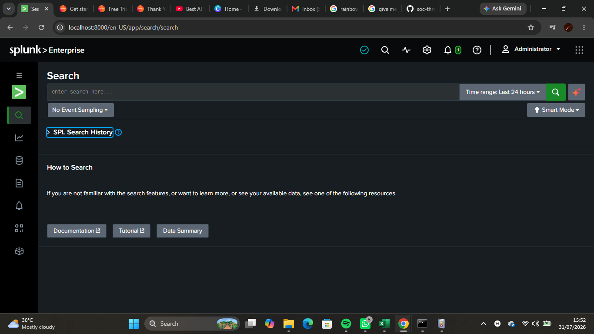
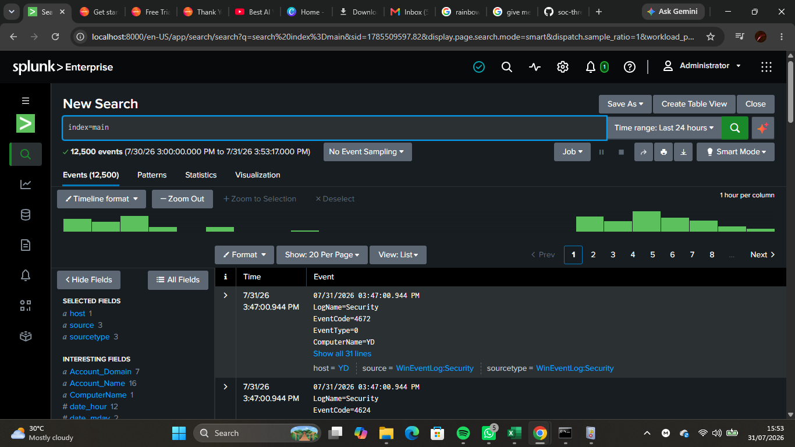
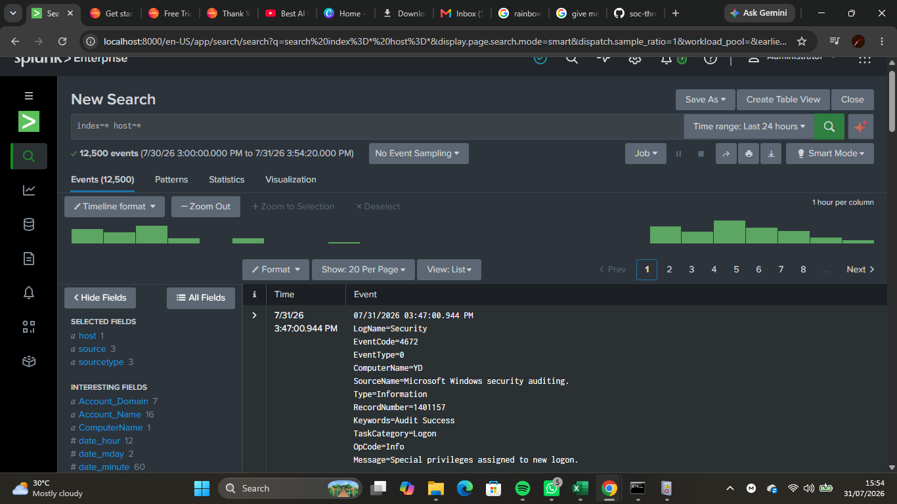
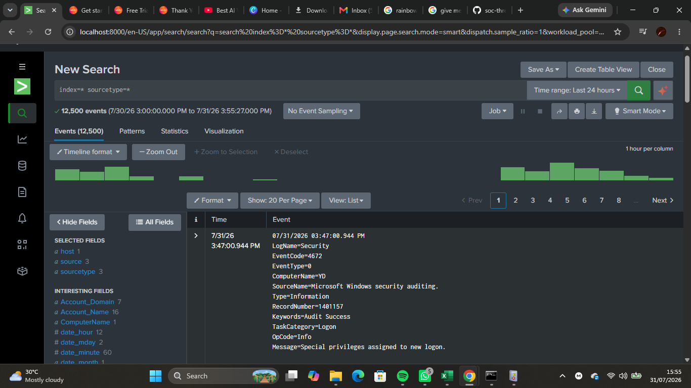
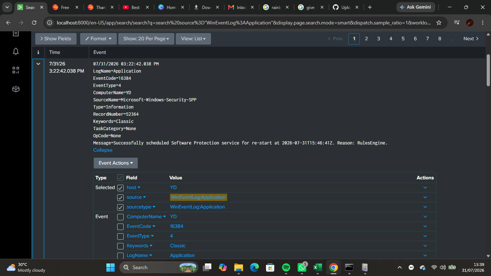

# Lab 06 — SPL Search Fundamentals

## Objective

Learned the fundamentals of Splunk Search Processing Language (SPL) by performing searches on Windows Event Logs, filtering results, and investigating security-related events.

---

## Background Theory

Search Processing Language (SPL) is Splunk's query language used to search, filter, analyze, and investigate data collected from various sources.

SOC analysts use SPL to quickly locate suspicious activity, identify security incidents, investigate authentication events, monitor system behavior, and perform threat hunting.

Understanding SPL is a fundamental skill for every Security Operations Center (SOC) analyst.

---

## Lab Environment

- Host Operating System: Windows 11
- SIEM Platform: Splunk Enterprise
- Data Source: Windows Event Logs
- Search Language: SPL
- Endpoint Monitoring: Microsoft Sysmon

---

## Skills Practiced

- Navigating the Search & Reporting application
- Writing basic SPL queries
- Searching indexed events
- Filtering search results
- Understanding hosts and sourcetypes
- Investigating Windows Event Logs
- Viewing event metadata
- Basic log analysis

---

## SPL Queries Used

### Display all indexed events

```spl
index=*
```

---

### Display events in the main index

```spl
index=main
```

---

### Search Windows Security Events

```spl
source="WinEventLog:Security"
```

---

### Search Windows System Events

```spl
source="WinEventLog:System"
```

---

### Search Windows Application Events

```spl
source="WinEventLog:Application"
```

---

### Display events with a host field

```spl
index=* host=*
```

---

### Display all available sourcetypes

```spl
index=* sourcetype=*
```

---

## Query Explanations

| Query | Purpose |
|--------|---------|
| `index=*` | Searches all indexed events |
| `index=main` | Searches events stored in the main index |
| `source="WinEventLog:Security"` | Displays Windows Security logs |
| `source="WinEventLog:System"` | Displays Windows System logs |
| `source="WinEventLog:Application"` | Displays Windows Application logs |
| `index=* host=*` | Filters events containing a host field |
| `index=* sourcetype=*` | Displays events grouped by sourcetype |

---

## Screenshots

### Search & Reporting Interface



---

### All Indexed Events


---

### Main Index



---

### Security Events


---

### System Events


---

### Application Events


---

### Host Filter



---

### Sourcetype Filter



---

### Event Details



---

## What I Observed

- Splunk successfully returned indexed Windows Event Logs.
- SPL queries quickly filtered events based on source and index.
- Each event contained useful metadata such as timestamp, host, source, and sourcetype.
- Different Windows logs provide different types of forensic evidence.
- The Search & Reporting application makes investigating large datasets efficient.

---

## Challenges Faced

- Initially learned how SPL syntax works and how searches are structured.
- Some searches returned no results until the correct data source and index were specified.
- Understanding the relationship between **index**, **source**, and **sourcetype** required careful observation.

---

## SOC Relevance

SPL is one of the primary tools used by SOC analysts during investigations.

It enables analysts to:

- Search millions of events quickly.
- Investigate suspicious activity.
- Detect authentication anomalies.
- Analyze Windows Event Logs.
- Support incident response.
- Build detections and alerts.

Mastering SPL significantly improves an analyst's ability to investigate and respond to security incidents.

---

## Lessons Learned

- SPL is the foundation of investigations in Splunk.
- Understanding indexes, sources, and sourcetypes improves search accuracy.
- Event metadata provides valuable context during investigations.
- Efficient searching reduces investigation time.
- Log analysis is a core responsibility of SOC analysts.

---

## Outcome

Successfully navigated Splunk's Search & Reporting application, executed fundamental SPL queries, filtered Windows Event Logs, and examined event details. This lab strengthened my understanding of SIEM investigations and the use of SPL for security monitoring.
