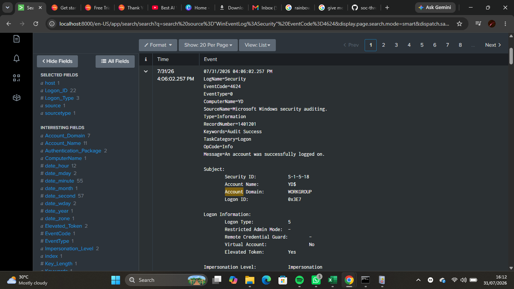
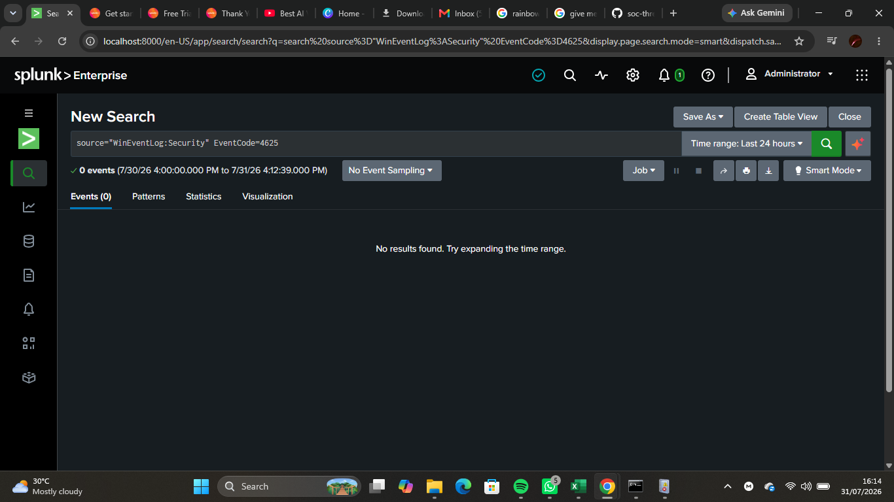
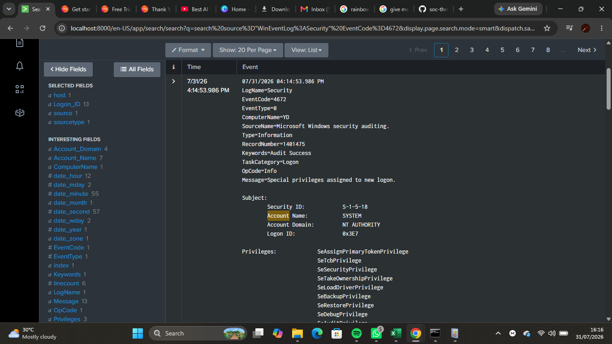
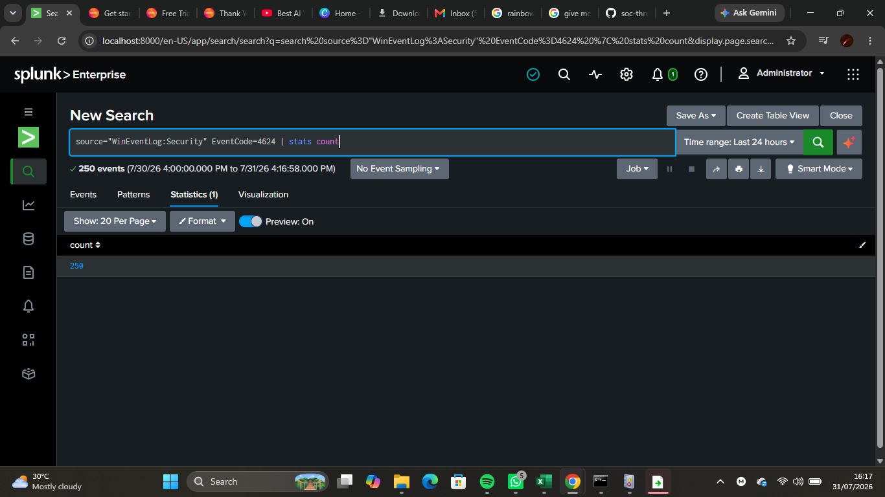
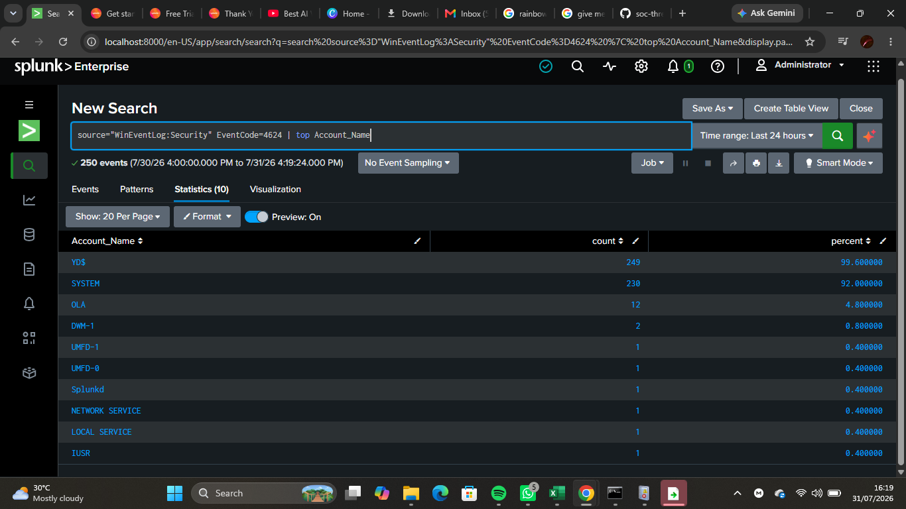

# Lab 07 — Windows Authentication Investigation

## Objective

Investigated Windows authentication events using Splunk Enterprise to identify successful logins, failed login attempts, privileged logons, and user account activity through Windows Security Event Logs.

---

## Background Theory

Windows records authentication-related events in the **Security Event Log** whenever users log on, log off, fail authentication, or perform account-related activities.

In a Security Operations Center (SOC), analysts continuously monitor these events to detect unauthorized access, brute-force attacks, privilege escalation, and suspicious user behavior.

By using Splunk Search Processing Language (SPL), analysts can quickly search, filter, and investigate authentication events across endpoints.

---

## Lab Environment

- Host Operating System: Windows 11
- SIEM Platform: Splunk Enterprise
- Data Source: Windows Security Event Logs
- Search Language: SPL

---

## Skills Practiced

- Windows authentication log analysis
- Searching Security Event Logs
- Identifying successful logins
- Identifying failed login attempts
- Investigating privileged logons
- Using SPL statistical commands
- Basic user activity analysis

---

## Windows Event IDs Investigated

| Event ID | Description |
|----------|-------------|
| 4624 | Successful Logon |
| 4625 | Failed Logon |
| 4634 | Logoff |
| 4672 | Special Privileges Assigned to New Logon |
| 4648 | Logon Using Explicit Credentials |
| 4720 | User Account Created |
| 4726 | User Account Deleted |
| 4732 | User Added to Security Group |

---

## SPL Queries Used

### View Successful Logons

```spl
source="WinEventLog:Security" EventCode=4624
```

---

### View Failed Logons

```spl
source="WinEventLog:Security" EventCode=4625
```

---

### View Privileged Logons

```spl
source="WinEventLog:Security" EventCode=4672
```

---

### Count Successful Logons

```spl
source="WinEventLog:Security" EventCode=4624 | stats count
```

---

### Display Top User Accounts

```spl
source="WinEventLog:Security" EventCode=4624 | top Account_Name
```

---

## Screenshots

### Successful Logons



---

### Failed Logons



---

### Privileged Logons



---

### Successful Logon Count



---

### Top User Accounts



---

## What I Observed

- Windows recorded successful user authentication events.
- Failed login attempts were visible when present.
- Privileged logons generated separate security events.
- SPL queries quickly filtered authentication-related events.
- Statistical commands summarized authentication activity effectively.

---

## Challenges Faced

- Understanding the purpose of different Windows Event IDs.
- Learning how to filter events using EventCode.
- Interpreting authentication-related log fields.
- Distinguishing between normal administrative activity and potential security concerns.

---

## SOC Relevance

Authentication monitoring is one of the primary responsibilities of a Security Operations Center.

SOC analysts use Windows authentication logs to:

- Detect brute-force attacks.
- Investigate unauthorized access.
- Monitor privileged account activity.
- Identify compromised user accounts.
- Track user logon behavior.
- Support incident response investigations.

Understanding authentication events is fundamental for detecting identity-based attacks.

---

## Lessons Learned

- Windows Security Event Logs provide detailed authentication information.
- Event IDs help analysts quickly identify specific security activities.
- SPL makes investigating authentication events efficient.
- Statistical commands help summarize large datasets.
- Authentication monitoring is a core SOC analyst responsibility.

---

## Outcome

Successfully investigated Windows authentication events using Splunk Enterprise and SPL. The lab demonstrated how Security Event Logs can be used to monitor user activity, identify authentication events, and support security investigations within a SOC environment.
