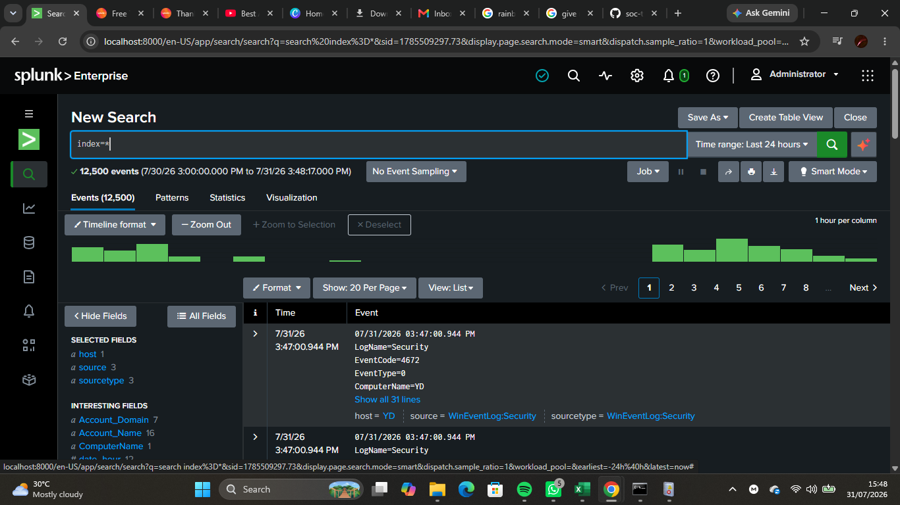
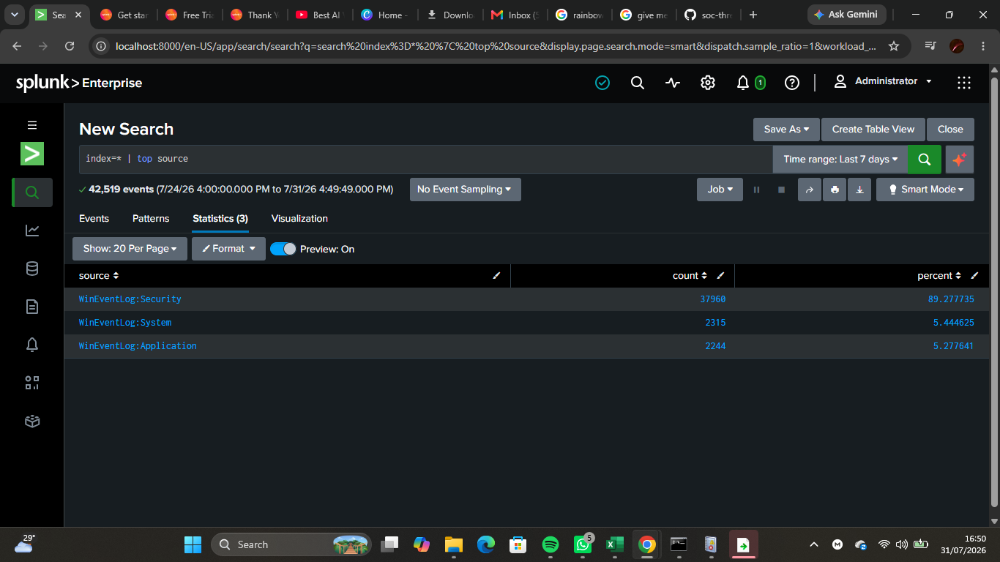
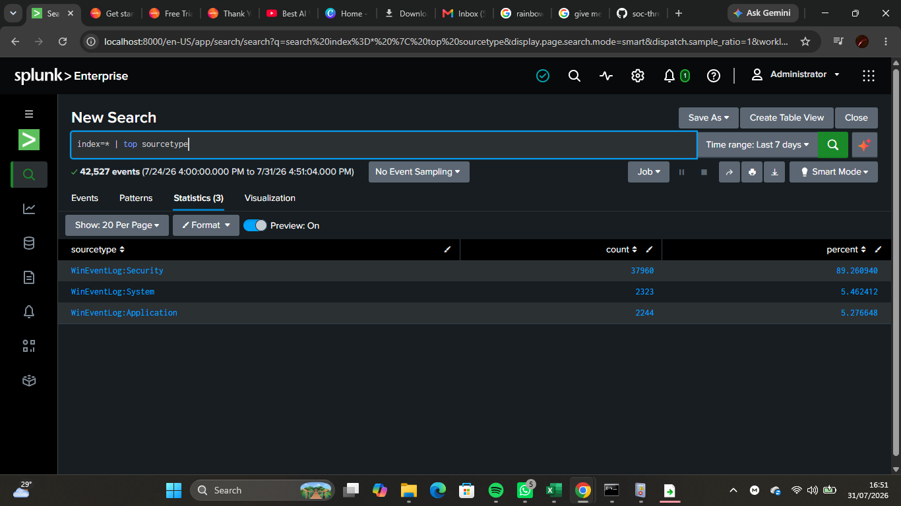
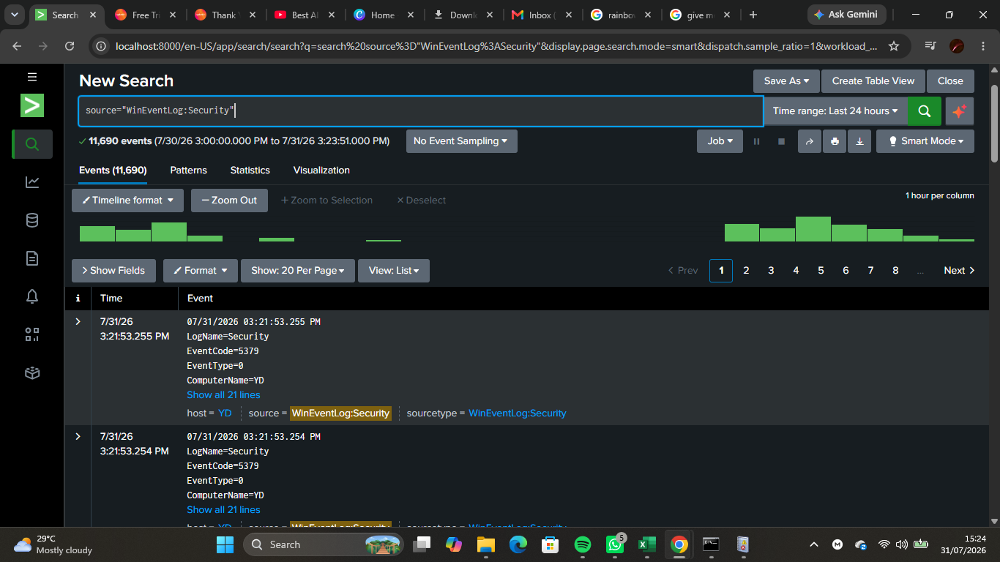
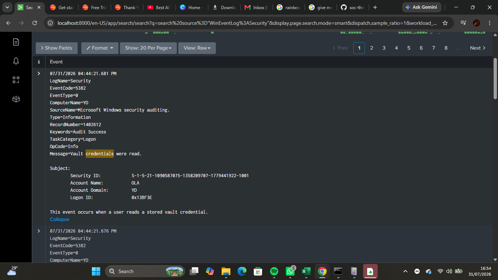

# Lab 08 — Threat Hunting with Splunk

## Objective

Performed a basic threat hunting exercise using Splunk Enterprise to proactively search Windows Event Logs for suspicious activities, analyze system events, and investigate potential security-related behaviors using Splunk Search Processing Language (SPL).

---

## Background Theory

Threat hunting is the proactive process of searching through logs and endpoint data to identify indicators of compromise (IOCs), suspicious behavior, or security threats that may not have triggered alerts.

Unlike traditional monitoring, threat hunting begins with a hypothesis and uses log analysis to determine whether malicious or unusual activity exists.

Splunk enables security analysts to perform threat hunting efficiently by searching, filtering, and analyzing large volumes of security events using SPL.

---

## Lab Environment

- Host Operating System: Windows 11
- SIEM Platform: Splunk Enterprise
- Data Source: Windows Event Logs
- Search Language: Splunk Search Processing Language (SPL)

---

## Skills Practiced

- Basic threat hunting
- Windows Event Log analysis
- SPL searching and filtering
- Investigating event metadata
- Identifying available log sources
- Reviewing authentication, system, and application events
- Security event analysis

---

## Threat Hunting Methodology

The investigation followed a simple threat hunting process:

1. Identify available data sources.
2. Review indexed events.
3. Analyze Windows Security logs.
4. Analyze Windows System logs.
5. Analyze Windows Application logs.
6. Investigate interesting events.
7. Document findings.

---

## SPL Queries Used

### Display all indexed events

```spl
index=*
```

---

### Identify top log sources

```spl
index=* | top source
```

---

### Identify top sourcetypes

```spl
index=* | top sourcetype
```

---

### Review Security Events

```spl
source="WinEventLog:Security"
```

---

### Review System Events

```spl
source="WinEventLog:System"
```

---

### Review Application Events

```spl
source="WinEventLog:Application"
```

---

## Screenshots

### All Indexed Events



---

### Top Sources



---

### Top Sourcetypes



---

### Security Events



---

### System Events


---

### Application Events


---

### Event Analysis



---

## Threat Hunting Findings

The investigation revealed that:

- Splunk successfully indexed Windows Event Logs.
- Multiple Windows log sources were available for analysis.
- Security, System, and Application logs contained useful operational information.
- Event metadata included timestamps, source, host, sourcetype, and event details.
- No obvious indicators of malicious activity were identified during the investigation.

---

## Challenges Faced

- Some advanced threat hunting queries returned no results because detailed endpoint telemetry (such as Sysmon process creation events) was not yet being ingested into Splunk.
- The investigation relied primarily on standard Windows Event Logs.
- Understanding available data sources before beginning a hunt proved to be an important first step.

---

## SOC Relevance

Threat hunting is a proactive security practice performed by SOC analysts to identify threats before they generate alerts.

By examining Windows Event Logs, analysts can:

- Detect suspicious login activity.
- Investigate abnormal system behavior.
- Identify application errors.
- Discover unusual user activity.
- Build hypotheses for deeper investigations.

Threat hunting complements traditional monitoring by helping analysts uncover hidden threats.

---

## Lessons Learned

- Effective threat hunting begins with understanding available log sources.
- SPL enables analysts to efficiently search and filter security events.
- Event metadata provides valuable context during investigations.
- Not every hunt results in malicious findings, but documenting normal activity is equally important.
- Standard Windows Event Logs provide a strong foundation for introductory threat hunting.

---

## Outcome

Successfully completed a basic threat hunting exercise using Splunk Enterprise. Windows Event Logs were analyzed, available data sources were identified, and multiple event types were investigated using SPL. The lab strengthened foundational skills in proactive security monitoring and log analysis within a Security Operations Center (SOC).
