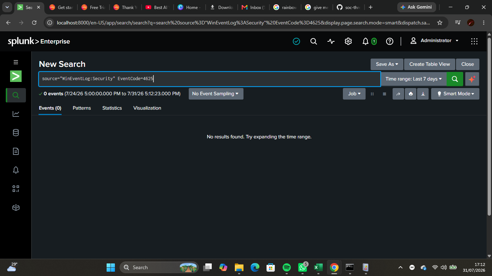
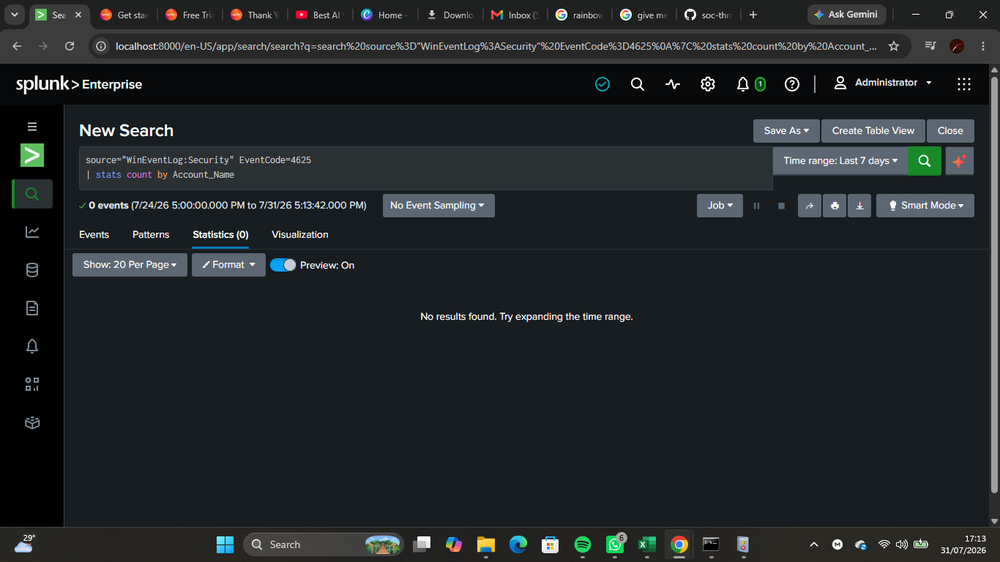
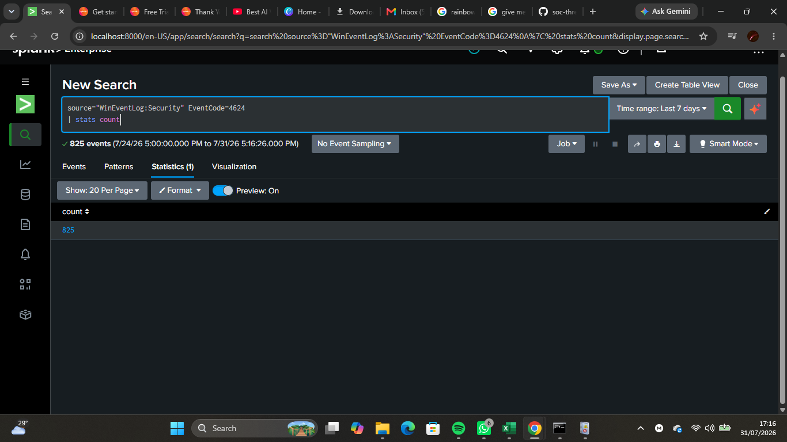
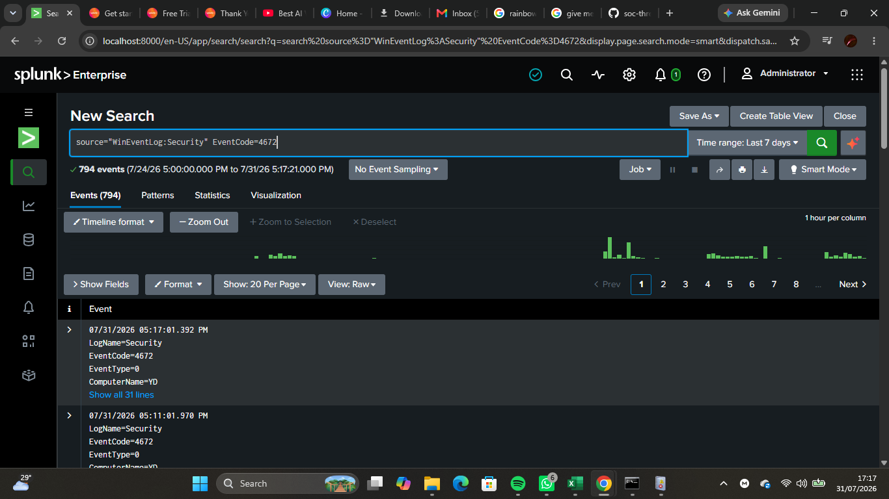
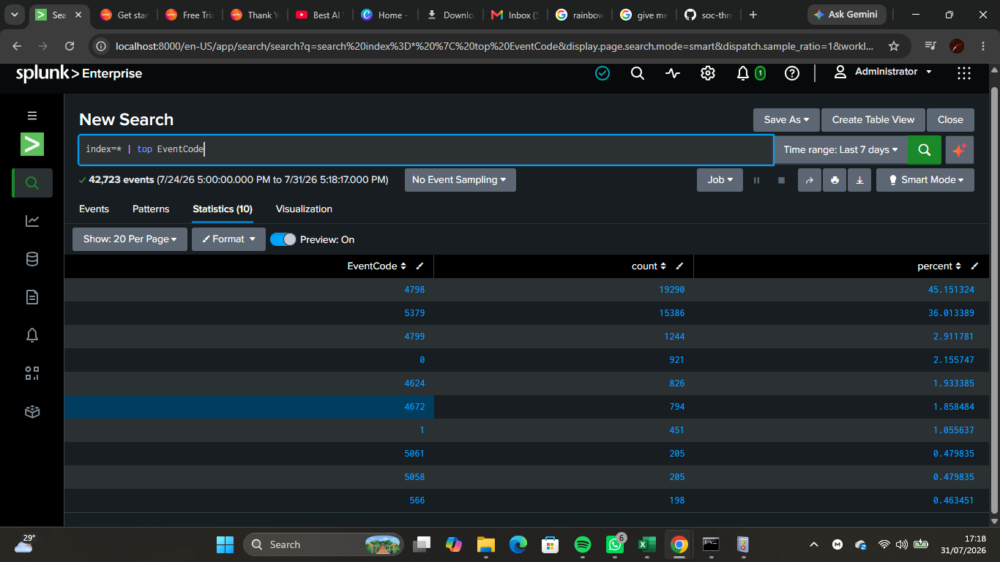
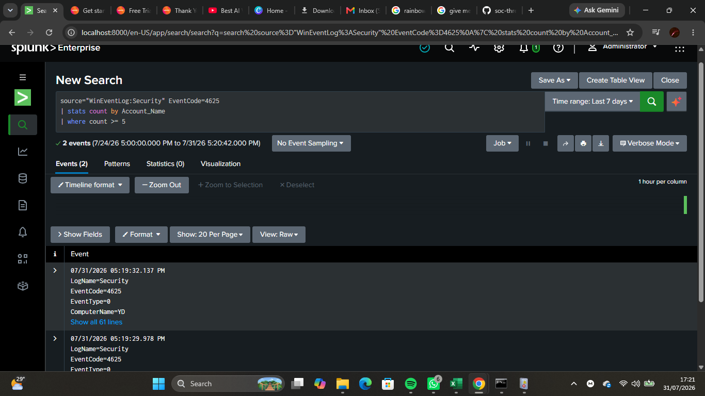

# Lab 09 — Detection Engineering with Splunk

## Objective

Developed and tested basic detection rules using Splunk Search Processing Language (SPL) to identify suspicious authentication activity within Windows Security Event Logs. This lab demonstrates how SOC analysts create detection logic that can later be converted into automated alerts.

---

## Background Theory

Detection engineering is the process of designing, testing, and improving detection rules that identify malicious or suspicious behavior within an environment.

Unlike threat hunting, which is a manual investigation, detection engineering focuses on building reusable searches that continuously monitor log data and notify analysts when predefined conditions are met.

Splunk enables analysts to create powerful detection logic using SPL, making it possible to detect authentication attacks, privilege escalation, account creation, service installation, and many other security events.

---

## Lab Environment

- Host Operating System: Windows 11
- SIEM Platform: Splunk Enterprise
- Data Source: Windows Security Event Logs
- Search Language: Splunk Search Processing Language (SPL)

---

## Skills Practiced

- Detection engineering fundamentals
- Writing SPL detection queries
- Authentication monitoring
- Windows Event Log analysis
- Statistical analysis using SPL
- Identifying suspicious login activity
- Building reusable detection logic

---

## Windows Event IDs Investigated

| Event ID | Description |
|----------|-------------|
| 4624 | Successful Logon |
| 4625 | Failed Logon |
| 4672 | Special Privileges Assigned to New Logon |

---

## Detection Queries

### Detect Failed Logons

```spl
source="WinEventLog:Security" EventCode=4625
```

---

### Count Failed Logons by User

```spl
source="WinEventLog:Security" EventCode=4625
| stats count by Account_Name
```

---

### Detect Successful Logons

```spl
source="WinEventLog:Security" EventCode=4624
```

---

### Count Successful Logons by User

```spl
source="WinEventLog:Security" EventCode=4624
| stats count by Account_Name
```

---

### Detect Privileged Logons

```spl
source="WinEventLog:Security" EventCode=4672
```

---

### Top Windows Event IDs

```spl
index=* | top EventCode
```

---

### Detection Rule — Multiple Failed Logins

```spl
source="WinEventLog:Security" EventCode=4625
| stats count by Account_Name
| where count >= 5
```

---

## Detection Logic

### Detection Name

**Multiple Failed Login Attempts**

### Description

Detects user accounts that generate five or more failed authentication attempts. A high number of failed logins may indicate password guessing, credential stuffing, or brute-force attacks.

### Severity

Medium

### Data Source

Windows Security Event Log

### MITRE ATT&CK Mapping

| Technique | ID |
|-----------|----|
| Brute Force | T1110 |

---

## Screenshots

### Failed Logons



---

### Failed Login Count



---

### Successful Logons


---

### Successful Login Count



---

### Privileged Logons



---

### Top Event Codes



---

### Detection Rule



---

## What I Observed

- Windows Security Event Logs recorded authentication activity.
- SPL statistical commands summarized login activity by user.
- Failed authentication attempts can be monitored using Event ID 4625.
- Successful logins can be monitored using Event ID 4624.
- Detection rules can be written using SPL to identify suspicious authentication behavior.

---

## Challenges Faced

- Some detection queries returned no results because no matching events had occurred during the selected time range.
- Understanding how to use `stats` and `where` together required practice.
- Building useful detections depends on having sufficient log data available.

---

## SOC Relevance

Detection engineering is one of the core responsibilities of modern SOC teams.

Detection rules help analysts:

- Identify brute-force attacks.
- Monitor privileged accounts.
- Detect abnormal authentication activity.
- Reduce investigation time.
- Automate security monitoring.

Well-designed detections improve an organization's ability to identify threats quickly and respond before they escalate.

---

## Lessons Learned

- SPL can be used to create reusable detection logic.
- Authentication events are valuable indicators of potential attacks.
- Statistical commands help summarize large datasets.
- Effective detections require both quality log data and an understanding of attacker behavior.
- Detection engineering complements threat hunting by providing continuous monitoring.

---

## Outcome

Successfully developed and tested basic SPL detection queries for Windows authentication events. The lab demonstrated how detection engineering supports proactive monitoring by identifying suspicious login behavior and providing a foundation for automated SIEM alerts.
