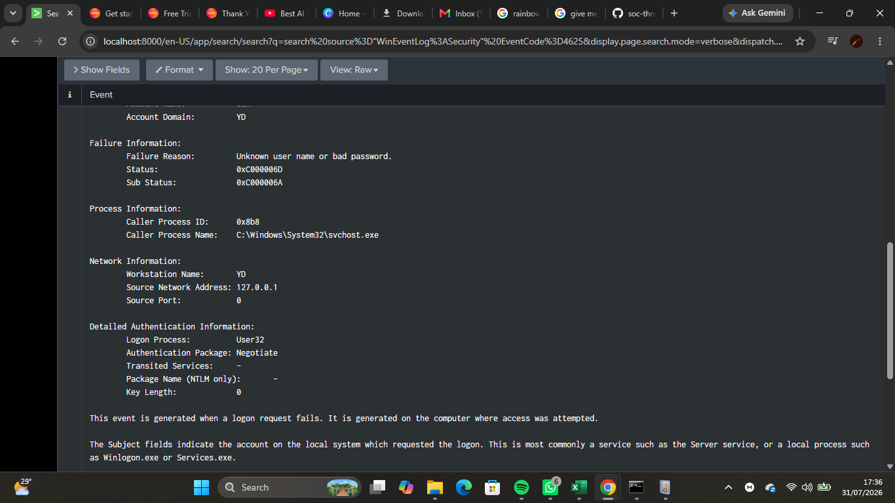
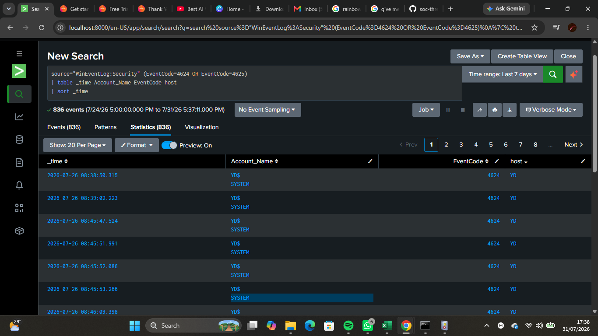
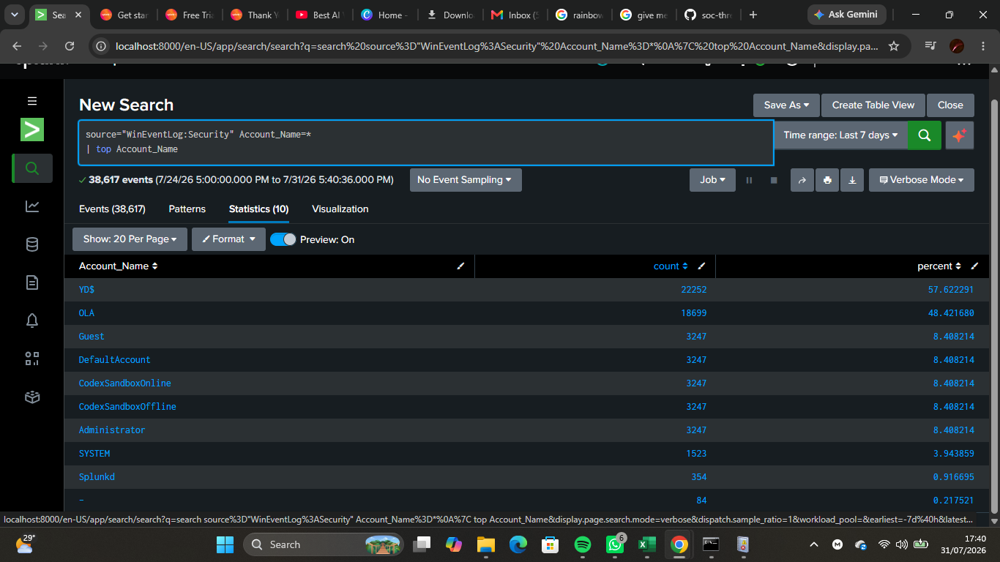
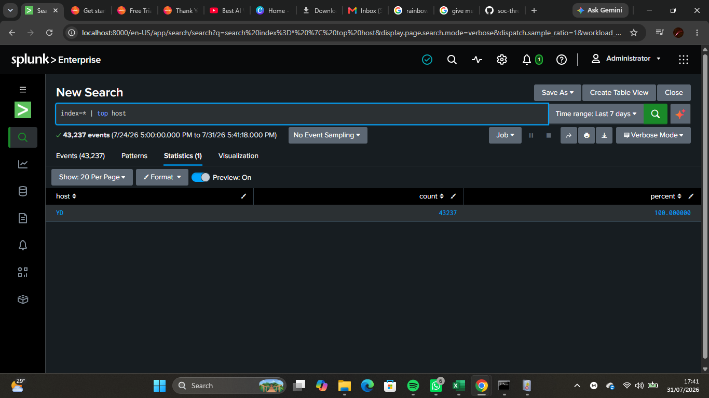

# Lab 10 — Incident Response Investigation

## Objective

Conducted a simulated Security Operations Center (SOC) incident response investigation using Splunk Enterprise. The investigation involved analyzing Windows authentication events, building an event timeline, determining the root cause of an alert, assessing the severity of the incident, and documenting findings and recommendations.

---

## Background Theory

Incident response is the structured process of identifying, investigating, containing, and documenting security incidents.

Within a Security Operations Center (SOC), analysts investigate security alerts generated by SIEM platforms such as Splunk. Their responsibilities include collecting evidence, analyzing log data, determining whether malicious activity occurred, and recommending appropriate response actions.

A typical incident response process follows these phases:

1. Preparation
2. Detection and Analysis
3. Containment
4. Eradication
5. Recovery
6. Lessons Learned

This lab focuses primarily on the **Detection and Analysis** phase.

---

## Incident Scenario

Splunk generated an alert indicating multiple failed authentication attempts for a Windows user account.

The objective was to determine:

- What triggered the alert?
- Which user account was involved?
- Which host generated the events?
- Was the activity malicious or expected?
- What recommendations should be made?

During testing, failed login attempts were intentionally generated by entering an incorrect Windows password multiple times to validate the detection rule created in Lab 09.

---

## Lab Environment

- Host Operating System: Windows 11
- SIEM Platform: Splunk Enterprise
- Data Source: Windows Security Event Logs
- Search Language: Splunk Search Processing Language (SPL)

---

## Skills Practiced

- Incident response
- Authentication investigation
- Timeline analysis
- Evidence collection
- Root cause analysis
- Security event analysis
- SPL searching
- Severity assessment
- Incident documentation

---

## Windows Event IDs Investigated

| Event ID | Description |
|----------|-------------|
| 4624 | Successful Logon |
| 4625 | Failed Logon |
| 4672 | Special Privileges Assigned to New Logon |

---

## Investigation Workflow

1. Review the SIEM alert.
2. Collect authentication events.
3. Build an event timeline.
4. Investigate the affected user account.
5. Analyze host activity.
6. Determine the root cause.
7. Assign an incident severity.
8. Document findings and recommendations.

---

## SPL Queries Used

### Review Failed Logons

```spl
source="WinEventLog:Security" EventCode=4625
```

---

### Build Authentication Timeline

```spl
source="WinEventLog:Security" (EventCode=4624 OR EventCode=4625)
| table _time Account_Name EventCode host
| sort _time
```

---

### Investigate User Activity

```spl
source="WinEventLog:Security" Account_Name=*
| top Account_Name
```

---

### Review Host Activity

```spl
index=* | top host
```

---

## Screenshots

### Alert Investigation



---

### Authentication Timeline



---

### User Investigation



---

### Host Investigation



---

## Evidence Collected

The investigation collected the following evidence:

- Failed authentication events
- Successful authentication events
- Username
- Hostname
- Event timestamps
- Windows Event IDs
- SPL search results
- Authentication timeline

---

## Investigation Findings

The investigation determined that:

- Splunk successfully detected repeated failed authentication attempts.
- Windows Security Event Logs recorded the authentication events.
- Authentication activity was successfully reconstructed into a timeline.
- The affected user account and host were identified.
- No evidence of unauthorized access or account compromise was found.

The failed login attempts were intentionally generated during testing to validate the SIEM detection rule developed in Lab 09.

---

## Incident Severity

**Severity:** Informational

### Justification

Although multiple failed login attempts were detected, they were intentionally generated in a controlled lab environment for detection validation. No malicious activity or unauthorized access was confirmed.

---

## Root Cause Analysis

The investigation concluded that the alert was triggered by intentionally entering an incorrect Windows password several times during testing.

The failed authentication attempts generated Windows Event ID **4625**, which matched the detection rule configured in Splunk.

The alert confirmed that the detection logic functioned correctly.

---

## Challenges Faced

- Reconstructing authentication events into a timeline.
- Interpreting authentication-related Event IDs.
- Distinguishing between legitimate testing activity and malicious behavior.
- Validating detection rules using controlled testing.

---

## SOC Relevance

Incident response is a core responsibility of Security Operations Center (SOC) analysts.

The techniques demonstrated in this lab enable analysts to:

- Investigate SIEM alerts.
- Collect digital evidence.
- Build timelines.
- Determine root causes.
- Assess incident severity.
- Recommend response actions.
- Document investigations.

---

## Lessons Learned

- SIEM alerts should always be validated through investigation.
- Windows Event Logs provide valuable authentication evidence.
- Timeline analysis helps reconstruct security events.
- Controlled testing is an effective way to validate detection rules.
- Proper documentation is essential for effective incident response.

---

## Outcome

Successfully completed a simulated incident response investigation using Splunk Enterprise. Authentication events were analyzed, evidence was collected, a timeline was created, the root cause was identified, and the incident was documented. The lab demonstrated the complete investigation workflow performed by Tier 1 SOC analysts when responding to authentication-related security alerts.
